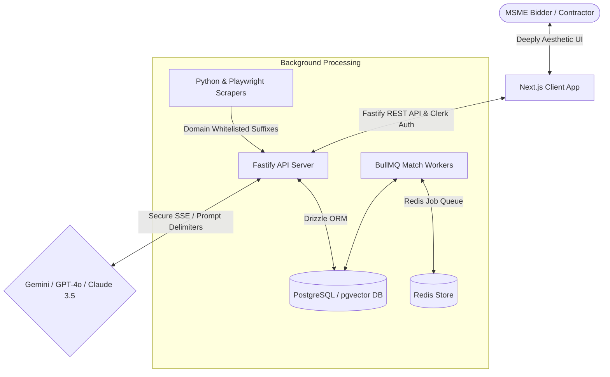

# TenderIQ

**The Premium, AI-Powered Tender Discovery, Scoring, and Bidding Intelligence Platform.**

TenderIQ is a next-generation B2B SaaS platform designed to revolutionize how businesses discover, analyze, and win government and private tenders. By leveraging advanced parallel scraping, vector embeddings, multi-tiered LLMs, and historical pricing intelligence, TenderIQ automates the complex bidding pipeline, enabling contractors and MSMEs to maximize win rates and accelerate revenue growth.

---

## 🏗️ System Architecture

The following diagram maps the core modules, background worker queues, and security boundaries within the TenderIQ ecosystem:



---

## 🚀 Current Status: Phase 1 & Phase 2 (Growth Engine) Complete!

We have successfully implemented and compiled the first two core horizons, including a comprehensive cybersecurity hardening pass (**Project Vajra-Shield**).

### ⚡ Live Platform Features:

#### 1. Advanced Scraping & Data Orchestration
- **Multi-Portal Parallel Scrapers:** Parallel scraping of 13 state portals (Maharashtra, Karnataka, Tamil Nadu, Uttar Pradesh, etc.) and CPPP using Playwright stealth routines.
- **Data Quality Gates:** Automated verification pipelines to ensure 100% state code coverage and minimal null fields before ingestion.

#### 2. Multi-Tiered AI Bid Copilot
- **Plan-Based LLM Routing:** Enforces model execution by subscription tier—Gemini (Starter), GPT-4o-mini (Pro), and Claude 3.5 Sonnet (Enterprise).
- **Interactive Chat & Proposal Generation:** Slide-out drawer with streaming responses, conversation history storage, markdown proposal compiler, and HTML-packaged Microsoft Word (.doc) exports.

#### 3. L1 Pricing Intelligence
- **CPPP Awards Scraper:** Python crawler compiling public contract results data.
- **Guidance Engine:** Real-time recommendations predicting competitor win counts, bidder density, and recommended L1 bidding price range (awarded amount/estimated value) based on historical contracts.

#### 4. Team Workspaces & Referral Loop
- **Multi-Seat Seating:** Role-Based Access Controls (RBAC) supporting invitations (Admin, Manager, Contributor, Viewer) and seat capacity enforcement.
- **Viral Referral Engine:** Unique referral link generation, click tracking, and performance statistics dashboard.

#### 5. Project Vajra-Shield (Level 3 Cybersecurity Hardening)
- **Throttling & Scanners Ban:** Sliding-window rate limiters and an IP-Scanner Autoban hook that blacklists clients requesting security configurations (`.env`, `.git/config`, etc.).
- **IDOR / BOLA Prevention:** Row-Level security mapping in Fastify routing that scopes all resource queries to the authenticated user's `orgId` and `userId`.
- **AI Security:** Wrap tender inputs in strict boundaries (`=== BEGIN TENDER DOCUMENT ===`) and implement system instructions isolators. Includes **AI Output Leak Filters** that scan response streams and block prompt exposures.
- **Scraper Domain Whitelists:** Scrapers verify destination URLs against a verified suffix list (`*.gov.in`) and sanitize text elements against HTML script injections.
- **CI/CD Security Gating:** Cloud Run deployments fail if dependencies present vulnerabilities via `npm audit --audit-level=high` checks.

---

## 🔮 Upcoming Horizon: Scale & Domination (Phase 3)

We are building a highly integrated B2B procurement ecosystem:
1. **Interactive WhatsApp Bot:** Instant tender alerts, deadline reminders, and natural language query interactions via Wati integrations.
2. **Reseller White-label Platform:** Custom domains, Let's Encrypt SSL routing, and reseller branding overlays for partner CA/legal firms.
3. **Public API & Webhook Dispatch:** Secure cryptographically hashed API tokens and HMAC-SHA256 outbound webhooks with exponential backoff retry queues.
4. **On-Demand Regionalization:** dynamic translations (Hindi, Marathi, Tamil, etc.) of tender summaries powered by Gemini on-demand translation layers.

---

## ⚙️ Quick Start Setup

### Backend (Server) Setup
1. Navigate to `/server`.
2. Configure environment variables in `.env`.
3. Install dependencies:
   ```bash
   npm install
   ```
4. Build and start the backend:
   ```bash
   npm run build
   npm run start
   ```

### Frontend (Client) Setup
1. Navigate to `/client`.
2. Configure environment variables in `.env.local`.
3. Install dependencies:
   ```bash
   npm install --legacy-peer-deps
   ```
4. Build and start Next.js app:
   ```bash
   npm run build
   npm run start
   ```

---

## 📁 Project Documentation

Detailed design specifications and implementation roadmaps are available in the `/docs` folder:
- [Implementation Plan 1: Foundation](./docs/Implementation_Plan_1_Foundation.md)
- [Implementation Plan 2: Growth Engine](./docs/Implementation_Plan_2_Growth_Engine.md)
- [Implementation Plan 3: Scale & Domination](./docs/Implementation_Plan_3_Scale_Domination.md)
